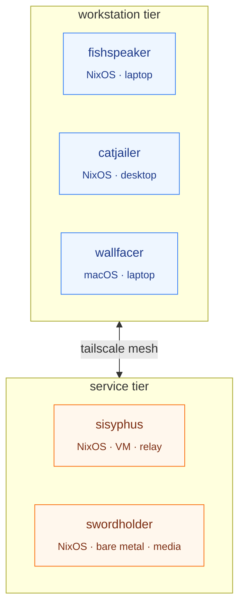

<h1 align="center">nixos</h1>
<p align="center"><em>Dendritic NixOS configuration for a small fleet. Bauhaus-tight, function-named, growable.</em></p>

<p align="center">
  <a href="PHILOSOPHY.md">philosophy</a> ·
  <a href="docs/index.md">wiki</a> ·
  <a href="docs/hosts.md">hosts</a> ·
  <a href="docs/tiers.md">tiers</a> ·
  <a href="docs/dendritic.md">dendritic</a> ·
  <a href="docs/log.md">log</a>
</p>

---

## Topology



## Fleet

| Host | Tier | Platform | Form factor | Role |
|------|------|----------|-------------|------|
| **fishspeaker** | workstation | NixOS (x86_64) | laptop | mobile workstation |
| **catjailer** | workstation | NixOS (x86_64) | desktop | primary workstation |
| **wallfacer** | workstation | nix-darwin (aarch64) | laptop | macOS workstation |
| **sisyphus** | service | NixOS (x86_64) | VM | network utility |
| **swordholder** | service | NixOS (x86_64) | bare metal | media / storage |

Details: [docs/hosts.md](docs/hosts.md).

## Principle

One rule governs this repo, spelled out in [PHILOSOPHY.md](PHILOSOPHY.md): **form follows function.** A module's name declares what it does; a host's `imports.nix` should read as a one-sentence description of the machine. Rename when names drift.

## Architecture

This repo follows the [Dendritic](https://github.com/mightyiam/dendritic) pattern: every `.nix` file is a flake-parts module, all addressable via a flat `flake.modules.<system>.<name>` namespace. Hosts compose modules; tier aggregates compose the baseline.

See [docs/dendritic.md](docs/dendritic.md) for what we keep from the spec and what we modify.

## Install

Disko + flake install (fresh machine, partitions a target disk):

```bash
sudo nix --extra-experimental-features 'nix-command flakes' run \
  'github:nix-community/disko/latest#disko-install' -- \
  --write-efi-boot-entries --flake .#<hostname> --disk main /dev/nvme0n1
```

If partitions are already mounted at `/mnt`:

```bash
sudo nixos-install --flake .#<hostname>
```

Apply config changes on a running system:

```bash
sudo nixos-rebuild switch --flake .#<hostname>
# or, preferred:
nh os switch
```

Remote deploy (service-tier hosts only):

```bash
nix run .#deploy -- .#<hostname>
```

If the installer runs out of RAM during disko-install (everything fits in tmpfs by default):

```bash
sudo swapon /dev/sda1                                  # external swap
sudo mount -o remount,size=24G,noatime /nix/.rw-store  # enlarge store
# or temporarily drop `desktop` from the host's imports.nix and add it back post-boot
```

## Layout

```
modules/
├── flake/    # flake output wiring (host builders, formatters, deploy)
├── nixos/    # NixOS modules — core, workstation, service, desktop, dev, server (leaves)
├── home/     # Home Manager modules — core, desktop, dev, linux, darwin, agents
├── darwin/   # macOS modules — core, dev, workstation
└── hosts/    # per-host config and imports (one folder per host)
```

## Acknowledgements

References and inspiration:

- [nat543207/nixos](https://github.com/nat543207/nixos)
- [bivsk/nix-iv](https://github.com/bivsk/nix-iv)
- [GaetanLepage/nix-config](https://github.com/GaetanLepage/nix-config)
- [gvolpe/nix-config](https://github.com/gvolpe/nix-config)
- [badele/nix-homelab](https://github.com/badele/nix-homelab) — README style
- [mightyiam/dendritic](https://github.com/mightyiam/dendritic) — composition pattern
